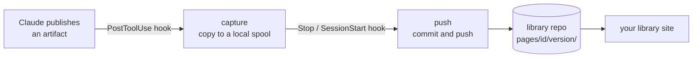

<h1 align="center">artifact-vault</h1>

<p align="center">Every page you publish from Claude Code, kept in your team's own git library — versioned, searchable, shareable.</p>

<p align="center">
  <a href="https://github.com/PhyrexTsai/artifact-vault/actions/workflows/ci.yml"></a>
  
  
</p>

<p align="center">
  <a href="#quick-start">Quick start</a> ·
  <a href="#skills">Skills</a> ·
  <a href="#how-it-works">How it works</a> ·
  <a href="#the-library-repo">Library repo</a> ·
  <a href="#privacy-and-safety">Privacy and safety</a> ·
  <a href="#faq">FAQ</a>
</p>

---

Plans, prototypes, research notes: Claude Code publishes them as claude.ai artifacts, and they stay in one person's account. Colleagues can't open a private artifact, old versions are hard to find, and nothing survives in your own repositories.

artifact-vault fixes that without changing how you work. A project opts in with one small file. From then on, **every page published in that project is copied into a git repository you own** — each version in its own folder — and a library site of your choice shows them to your team.

## See it in action

```
You:     make an HTML plan for the search box
Claude:  ⏺ Artifact("plan.html")  Published
         PostToolUse:Artifact says: artifact-vault：已排入書庫 acme：「Search box plan」
         … when the turn ends, the version is pushed to git@github.com:acme/acme-artifact.git
```

| You keep doing | artifact-vault adds |
|---|---|
| Ask Claude for a page and let it publish | A copy of every version in your library repo |
| Republish after edits | One folder per version; old ones stay untouched |
| Say "don't archive this" | The page is marked and skipped |
| Send a page to a colleague | A library link they can open, instead of your private claude.ai link |

## Quick start

### 1. Install

```bash
claude plugin marketplace add PhyrexTsai/artifact-vault
claude plugin install artifact-vault@artifact-vault --config author_email=you@example.com
```

`author_email` is recorded as the author of the pages you publish. Use the email you sign in to your library site with: the site can then show each author the private claude.ai link of their own pages. To change it later:

```bash
echo '{"author_email":"new@example.com"}' | claude plugin configure artifact-vault@artifact-vault --values-stdin
```

### 2. Point a project at a library

Create `.claude/artifact-vault.json` in the project:

```json
{ "vault": "git@github.com:acme/acme-artifact.git" }
```

The value is any git address you can push to without a prompt (or an absolute path). Projects without this file are ignored completely.

To turn the plugin on for everyone who opens the project, also commit `.claude/settings.json`:

```json
{
  "extraKnownMarketplaces": {
    "artifact-vault": { "source": { "source": "github", "repo": "PhyrexTsai/artifact-vault" } }
  },
  "enabledPlugins": { "artifact-vault@artifact-vault": true }
}
```

Claude Code asks each person once to trust the project's plugin settings.

### 3. Publish as usual

Ask for a page the way you always do. After a publish you see `artifact-vault：已排入書庫 …` ("queued for the library"); the push happens in the background when the turn ends.

### 4. Check

```
/artifact-vault:setup
```

It reports which library the project uses, your author email, what is waiting, and the last push result.

### Stay updated

```bash
claude plugin marketplace update artifact-vault
```

## Skills

You rarely call these yourself: Claude picks them from what you say.

| Skill | Say | What happens |
|---|---|---|
| `page` | "make an HTML page for …", "don't archive this" | Starts the page from the library's template for its type, draws diagrams with archify (when installed) or Mermaid, and marks pages you want kept out |
| `tag` | "categorize that page as research" | Changes a page's type without editing any version |
| `backfill` | "add this page to the library", "backfill the search pages" | Reads pages published earlier back from claude.ai and adds them; a keyword batch is confirmed before anything is read |
| `purge` | "remove this page from the library for good" | Rewrites the library's history without the page, after you type its id to confirm |
| `setup` | "is archiving working?" | Read-only status report |

## How it works



| Step | What happens |
|---|---|
| **Capture** | After every successful publish, a hook copies the page and the files that publish wrote into a local spool. It never touches the network, so it cannot slow the session down. |
| **Check** | A page is skipped when it contains `vault:skip`, and refused when it looks like it holds a credential. |
| **Push** | When the turn ends, the plugin's private clone of the library is reset to the remote, the queued versions are committed, the commit is checked byte for byte, and pushed. A failed push undoes the commit and keeps the spool; the next run starts over from the remote. |
| **Show** | Your library site reads the repo and lists the pages. Hiding consecutive identical versions and rebuilding a version's full file set happen there. |

Nothing is shared between versions, so several machines push to the same library without conflicts.

## The library repo

```
vault.json                         library name, page types, templates
templates/                         what the page skill starts new pages from
pages/<id>/<version>/index.html    the page as published
pages/<id>/<version>/<files>       files that publish wrote
pages/<id>/<version>/meta.json     metadata of that version
overrides/<id>/<time>-<rand>.json  category changes (the newest wins)
purged/<id>.json                   pages removed with purge (never pushed again)
```

A version holds only what its publish changed: a republish keeps the files it did not list. To rebuild the files of a version, replay versions in `seq` order up to it: written files replace, removed files drop, and a version marked `"snapshot": true` (a backfilled version, which holds the whole page) starts the file set over before its own files are added.

<details>
<summary><code>meta.json</code> fields</summary>

| Field | Meaning |
|---|---|
| `id`, `url`, `title`, `version`, `seq` | The artifact, as the publish reported it |
| `author` | The publisher's `author_email` |
| `repo` | The project repo it was published from |
| `type` | From `<meta name="vault:type">` in the page, or `unsorted` |
| `files_written`, `files_removed`, `files_remote` | What this publish changed |
| `capabilities` | Runtime capabilities the page declared (a library copy cannot use them) |
| `captured_at`, `digest` | When it was captured, and a content id for hiding identical versions |
| `source`, `snapshot` | Set on backfilled versions |

</details>

<details>
<summary><code>vault.json</code> example</summary>

```json
{
  "name": "acme",
  "css": "templates/base.css",
  "logo": "templates/logo.svg",
  "types": {
    "dev-plan": { "label": "Development plan", "template": "templates/dev-plan.html", "diagram": ["archify", "mermaid"] }
  }
}
```

</details>

### Library site

The plugin only writes the repo; any site that reads the layout above works. When you build one:

- Serve archived pages in a sandbox (for example a CSP `sandbox` header without `allow-same-origin`), so a page cannot read your site's session.
- Show the claude.ai link only to the page's author: it points to a private artifact.
- Rebuild a version's files by replaying versions as described above.

## Privacy and safety

- **Opt-in per project.** Without `.claude/artifact-vault.json` the plugin does nothing.
- **Keep a page out** by having it contain `vault:skip` (the `page` skill adds `<meta name="vault:skip">` when you ask). The check is strict: the token anywhere in the page, even entity-encoded, skips it.
- **Credentials** (cloud keys, tokens, private keys) found in the page, its title, file names or files stop the capture. Only the kind is reported, never the match.
- **The private clone** belongs to the plugin and is only ever reset to the remote. Your global git hooks do not run in it, so formatters cannot rewrite archived pages; your own repositories are not affected.
- **Purge** removes a page from the branch and all of its history and blocks it from coming back. It cannot reach copies outside the branch:
  - every other clone of the library repo must run `git fetch origin && git reset --hard origin/<branch>` (a `git pull` would merge the old history back);
  - GitHub keeps pull request refs, forks and cached views until GitHub Support removes them;
  - rotate any secret the page held.

## When someone leaves

Remove their access wherever it is granted:

1. The library site's allowlist (for example an `ALLOWED_EMAILS` config var), then restart the site.
2. The sign-in provider's test users or allowed accounts (for example Google OAuth test users).
3. GitHub access to the library repo and to every project repo with a `.claude/artifact-vault.json`.
4. What they published stays in the library; purge pages only when they must not be kept.

## Limits

- **Claude Code only.** Pages published from claude.ai chat, from Claude Code on the web (which does not load a repo's plugins), or with `claude -p` (which has no Artifact tool) are not captured; backfill adds them later.
- **Backfill reads the live version only.** Earlier versions of a page published before the project used a library cannot be recovered.
- **Backfill ordering.** A read-back page has no publish count, so its version is numbered after what the library has. If another machine holds an unpushed capture of the same page, it arrives later with a higher number and sorts as the newest. Let that machine push first (open Claude Code there, or run `/artifact-vault:setup`).

## FAQ

<details>
<summary>Does it change how Claude publishes?</summary>

No. Publishing works as before; the hooks only read what was published.
</details>

<details>
<summary>What if I'm offline?</summary>

Versions wait in the spool and are pushed by the next turn or session that can reach the library.
</details>

<details>
<summary>Can two people publish to the same library at once?</summary>

Yes. Every version has its own folder; a push that loses the race starts over from the remote.
</details>

<details>
<summary>A page is missing from the library. Why?</summary>

Run `/artifact-vault:setup`. Common causes: the project has no `.claude/artifact-vault.json`, the page contains `vault:skip`, a credential was detected, or the push has not run yet (it runs when the turn ends).
</details>

## Development

```bash
claude plugin validate --strict ./plugin
claude plugin validate --strict .
python3 -m unittest discover -s tests -v
LEAK_PATTERNS="$(cat ~/.config/artifact-vault/leak-patterns)" python3 scripts/leak_scan.py
```

This repo is public. CI fails if a tracked file or a commit message contains a private string from the `LEAK_PATTERNS` secret, a local path, or an artifact link, or if a commit is not authored with a GitHub noreply email.
